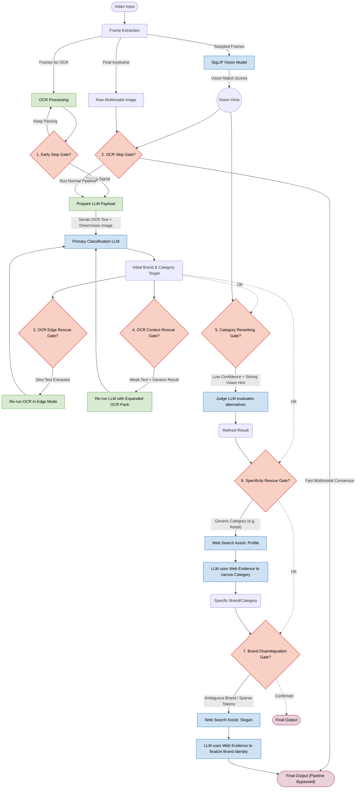

# Pipeline Decision Gates and Web Search Assist

This document explains the various decision gates within the video ad classification pipeline and how web search queries are dynamically constructed to assist the LLM when it encounters ambiguity.

## 1. Pipeline Decision Gates

The Scenalyze video classification pipeline utilizes several intelligent "short-circuits" or "rescue ladders." They evaluate the quality of intermediate outputs (like OCR text or visual embeddings) to either skip unnecessary LLM calls (saving processing time and API costs) or trigger deeper recovery behaviors when the initial output is poor.

Here are the details of each gate and when it is used:

### The Early Stop Gate (`_ocr_text_is_strong_for_early_stop`)
* **When it runs:** In the middle of extracting and processing Optical Character Recognition (OCR) text from frames.
* **What it does:** It looks at the OCR string just pulled from the current frame. Does it look like a highly confident brand signal? (e.g., it contains a `.com` domain name, or has multiple long string tokens). 
* **The Decision:** If the signal is very strong, the pipeline *stops* running OCR on any remaining frames, skipping straight to the final LLM prompt with the text it already gathered.

### The OCR Skip Gate (`_ocr_skip_high_confidence_enabled`)
* **When it runs:** Right before the normal OCR extraction loop begins (when `Enable Vision` is ON).
* **What it does:** It performs a "pre-flight" check using just the final frame of the video plus the zero-shot SigLIP vision model. It does a rapid, cheap LLM check on that final frame.
* **The Decision:** It compares the LLM's classification against SigLIP's top visual category. If they match *and* the LLM confidence is very high (default > `0.90`), the pipeline completely bypasses the time-consuming OCR loop and returns the result instantly.

### The OCR Edge Rescue Gate (`_should_run_ocr_edge_rescue`)
* **When it runs:** After the first main LLM classification finishes, but returns a "blank" or zero-confidence result.
* **What it does:** It checks if the OCR string that was sent to the LLM was completely empty or had zero signals.
* **The Decision:** If the LLM failed *because* it was starved of text, the pipeline triggers an "Edge Rescue." It re-runs the OCR engine, but this time turning on "Edge Mode", and tries the LLM again with the new text.

### The OCR Context Rescue Gate (`_should_run_ocr_context_rescue`)
* **When it runs:** After the first main LLM classification finishes, when OCR succeeded in finding text, but the LLM still struggled to map it confidently.
* **What it does:** It checks if the OCR text visually lacked obvious "commercial context" (like the words promo, sale, discount, etc.). It then checks if the LLM's confidence was low, the taxonomy mapping was weak, or there was a visual mismatch with SigLIP.
* **The Decision:** It forces the pipeline to re-gather a much larger, expanded "Context Pack" of OCR text (bypassing strict deduplication) and re-prompts the LLM with this denser wall of text to see if it can find hidden context.

### The Specificity Search Rescue Gate (`_should_run_specificity_search_rescue`)
* **When it runs:** After an LLM classification returns a valid brand, but the category mapping is too vague or broad (e.g., returns "Retail").
* **What it does:** It checks if the predicted brand is a real-world entity and compares the mapping score to visual scores from SigLIP.
* **The Decision:** If the category is generic, it triggers an intelligent Search assist. It looks up the company profile, injects that world knowledge into the context, and re-prompts the LLM to get a highly specific, granular category (e.g., "Women's Footwear" instead of "Retail").

### The Category Reranking Gate (`_should_run_category_rerank`)
* **When it runs:** After the LLM gives a valid prediction, but the confidence score is hovering in the "lukewarm" zone, or the taxonomy map margin is extremely tight (tie-breaker scenario).
* **What it does:** It evaluates the uncertainty and looks for contradiction against vision scores or text evidence.
* **The Decision:** It dynamically gathers the evidence and asks a separate "Judge" LLM to evaluate the top 5 possible categories, potentially overriding the initial classification.

### The Brand Ambiguity Guard (`_should_trigger_brand_ambiguity_guard`)
* **When it runs:** At the very end of the pipeline.
* **What it does:** It checks if the predicted brand is known to be ambiguous or if the LLM hallucinated the brand from extremely sparse OCR tokens.
* **The Decision:** It triggers a Specificity Search query (e.g. `official brand slogan`) and forces a secondary LLM call to verify the brand via the internet. It marks the brand as `resolved` or rejects the verification.

---

## 2. Deep Dive: How Category Reranking Works

The **Category Reranking Gate** (the "Judge" phase) is a highly specialized guardrail designed to correct the primary LLM when it struggles to map a fragmented video into the strict Freewheel taxonomy.

It operates in three distinct phases: **Detection**, **Contradiction Checking**, and **Judgment**.

### Phase 1: Detecting Uncertainty
When the primary LLM outputs a raw category string (e.g., "Technology"), the system embedding-maps this string against the taxonomy database to find the closest official matches. The gate flags the result as "uncertain" if:
1. **Low Top-1 Score:** The best match has a similarity score under `0.62`.
2. **Tight Top-2 / Top-3 Margins:** The gap between the #1 match and the #2/#3 match is incredibly small (under `0.02`), meaning it's virtually a tie.

### Phase 2: Seeking Contradiction
If uncertainty is detected, it looks for **conflicting evidence**:
1. **Freeform vs. Exact:** Did the LLM guess a phrase that isn't actually in the taxonomy?
2. **Text Evidence Mismatch:** Mapping the LLM's raw reasoning + OCR text yields a *different* top category.
3. **Visual Mismatch:** SigLIP's top visual category is different from the LLM's category, and SigLIP's confidence is very high.

If there is uncertainty **and** a contradiction, the gate swings open. It gathers the Top 5 structural candidates and the Top 3 visual hints and passes them to the Judge.

### Phase 3: The Judge and Acceptance
A specialized "Judge LLM" is invoked. It is explicitly told *why* the fallback was triggered (e.g., `top1_top2_gap=0.015;vision_prefers='Automotive'`). It is fed the OCR, the reasoning, the visual hints, and a strict list of the **Top 5 Candidates**.

Once the Judge answers, the pipeline runs a strict validation check (`_accept_category_rerank_result`):
* Did the Judge actually pick a category from the exact 5 candidates provided?
* Did the Judge actually change the category?
If it passes, the new category overwrites the old one for the final output.

---

## 3. Web Search Query Formation

When the web search assist is triggered, the `SearchManager` dynamically forms queries based on **why** it needs help. 

There are 3 distinct query formations:

### 1. Brand Disambiguation Search 
*(Triggered when it finds a brand name but isn't sure if it's the right context)*
* It builds a query to find official confirmation. It extracts the very first `.com` / domain from the OCR.
* It wraps the first word in exact quotes `""` to anchor the search.
* It appends keywords: `official brand slogan`.
* **Example:** `site:toyota.com "toyota.com" "bZ" official brand slogan`

### 2. Specificity Search / Category Rescue 
*(Triggered when it knows the brand, but the category is too generic like "Retail")*
* It takes the predicted `brand` string.
* It appends the hardcoded keywords: `official brand company`.
* **Example:** `Toyota official brand company`

### 3. Total Failure Fallback Search
*(Triggered when the LLM completely fails to identify anything from the fragmented text)*
* It attempts to blindly search the raw OCR text to see if the internet has indexed similar strings.
* It takes the first 8 words of the raw OCR text.
* It appends the keyword: `brand company product`.
* **Example:** `Drive the new bZ today at your local brand company product`

### Injection into LLM Context
In all cases, the top raw HTML or JSON snippets returned from the search engine are injected directly into the LLM's system prompt as a `Web Evidence` block.

---

## 4. The Role of Visual Hints (Multimodal vs. SigLIP)

The Scenalyze pipeline relies heavily on "visual hints" to interpret a video. These hints are generated and consumed in two fundamentally different ways:

### A. Direct Vision (Multimodal LLM Inference)
* **How it works:** When a vision-capable provider (like Gemini Pro Vision or LLaVA/Qwen-VL) is used, and the `Enable Vision` setting is toggled on, the pipeline extracts the final keyframe of the video as a raw image.
* **The Weight:** The LLM acts as the primary "eyes" of the system. It directly interprets the pixels to understand the product. This is the heaviest and most direct form of visual evidence and is injected alongside the OCR text.

### B. Indirect Vision (The SigLIP "Vision Board")
* **How it works:** SigLIP is a lightweight, zero-shot image classification model. It looks at sampled frames from the video and simply scores (from 0.0 to 1.0) how strongly the image matches each descriptive category from the taxonomy.
* **When it is used:** These SigLIP scores are heavily used by the **Decision Gates** and **Recovery Ladders** as secondary, mathematical proof when the primary text or LLM prediction is weak or confusing. (e.g. OCR Skip Gate, Specificity Rescue, Category Reranking, and ReACT Agent TOOL: VISION requests).

---

## 5. Pipeline Architecture Diagram

The flowchart below illustrates how data moves through the pipeline, where visual and web search hints are injected, and where decision gates execute.

