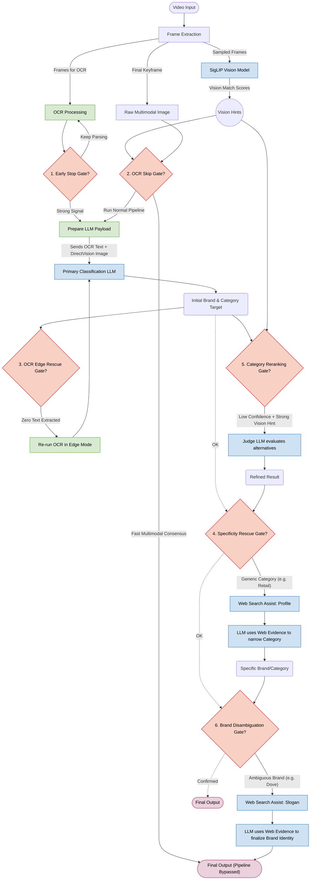

# Pipeline Decision Gates and Web Search Assist

This document explains the various decision gates within the video ad classification pipeline and how web search queries are dynamically constructed to assist the LLM when it encounters ambiguity.

## 1. Pipeline Decision Gates

The Scenalyze video classification pipeline utilizes several intelligent "short-circuits" or "rescue ladders." They evaluate the quality of intermediate outputs (like OCR text or visual embeddings) to either skip unnecessary LLM calls (saving processing time and API costs) or trigger deeper recovery behaviors when the initial output is poor.

Here are the details of each gate and when it is used:

### The Early Stop Gate (`_ocr_text_is_strong_for_early_stop`)
* **When it runs:** In the middle of extracting and processing Optical Character Recognition (OCR) text from frames, frame by frame.
* **What it does:** It looks at the OCR string just pulled from the current frame. Does it look like a highly confident brand signal? (e.g., it contains a `.com` domain name, or has multiple long string tokens like `[HUGE] FORD MOTOR COMPANY`). 
* **The Decision:** If the signal is very strong, the pipeline *stops* running OCR on any remaining frames to save processing time and API costs, skipping straight to the final LLM prompt with the text it already gathered.

### The OCR Skip Gate (`_ocr_skip_high_confidence_enabled`)
* **When it runs:** Right before the normal OCR extraction loop begins (when `Enable Vision` is ON).
* **What it does:** It performs a "pre-flight" check using just the final frame of the video plus the zero-shot SigLIP vision model. It does a rapid, cheap LLM check on that final frame.
* **The Decision:** It compares the LLM's classification against SigLIP's top visual category. If they match *and* the LLM confidence is very high (default > `0.90`), it mathematically proves the brand and category are obvious from the end frame alone. The pipeline completely bypasses the time-consuming OCR loop and returns the result instantly.

### The OCR Edge Rescue Gate (`_should_run_ocr_edge_rescue`)
* **When it runs:** After the first main LLM classification finishes, but returns a "blank" or zero-confidence result.
* **What it does:** It checks if the OCR string that was sent to the LLM was completely empty or had zero letters/signals.
* **The Decision:** If the LLM failed *because* it was starved of text, the pipeline triggers an "Edge Rescue." It re-runs the OCR engine, but this time turning on "Edge Mode" (or a different, more sensitive OCR profile) and tries the LLM again with the new text.

### The Specificity Search Rescue Gate (`_should_run_specificity_search_rescue`)
* **When it runs:** After an LLM classification returns a valid brand, but the category is too vague or generic (e.g., returns "Apparel" instead of "Women's Footwear", or returns "Insurance" instead of "Auto Insurance").
* **What it does:** It checks if the predicted brand is a real-world entity and pairs it with the visual scores from SigLIP.
* **The Decision:** If the category is generic, it triggers an intelligent Google Search for the brand. It reads the first page of Google results, injects that world knowledge into the context, and re-prompts the LLM to provide a highly specific, granular category.

### The Category Reranking Gate (`_should_run_category_rerank`)
* **When it runs:** After the LLM gives a valid prediction, but the confidence score is hovering in the "lukewarm" zone (e.g., 0.60 - 0.75).
* **What it does:** It looks at the SigLIP vision scores. Did SigLIP strongly predict a totally different category than the LLM? Is there conflicting evidence?
* **The Decision:** If the LLM is unsure, the system dynamically gathers "Evidence." It builds a payload combining the visual scores, the OCR text, and the search text, and asks a "Judge" LLM to re-evaluate the top 3 possible categories and pick the best one, overriding the initial classification.

### The Brand Disambiguation Gate (`_should_run_brand_disambiguation`)
* **When it runs:** At the very end of the pipeline, if the system's "Brand Ambiguity Guard" is enabled.
* **What it does:** It checks if the predicted brand matches known "ambiguous" entities in its mapper (for example, if the OCR saw "Dove", does the video look like Chocolate or Soap?).
* **The Decision:** It forces a secondary, specialized LLM call. It asks the model to explicitly look at the visual frame and the OCR context to definitively prove *which* "Dove" it is, altering the final output state to mark the brand as either `resolved` or `unresolved`.

---

## 2. Web Search Query Formation

When the web search assist is triggered (e.g., via Specificity Rescue or Brand Disambiguation), the `SearchManager` dynamically forms queries based on **why** it needs help. 

There are 3 distinct query formations used by the pipeline:

### 1. Brand Disambiguation Search 
*(Triggered when it finds a brand name but isn't sure if it's the right context)*

It builds a complex query using `_build_brand_disambiguation_query()` to find official confirmation.
*   It extracts the very first `.com` / domain from the OCR and adds: `site:domain.com "domain.com"`
*   It takes up to the first 6 unique words from the OCR frame. It wraps the first word in exact quotes `""` to anchor the search.
*   It appends the hardcoded keywords: `official brand slogan`.
*   **Example Output:** `site:toyota.com "toyota.com" "bZ" official brand slogan`

### 2. Specificity Search / Category Rescue 
*(Triggered when it knows the brand, but the category is too generic like "Retail")*

It needs to look up the exact company profile to categorize its primary industry.
*   It takes the predicted `brand` string.
*   It appends the hardcoded keywords: `official brand company`.
*   **Example Output:** `Toyota official brand company`

### 3. Total Failure Fallback Search
*(Triggered when the LLM completely fails to identify anything from the fragmented text)*

It attempts to blindly search the raw OCR text to see if the internet has indexed similar combinations of text.
*   It takes the first 8 words of the raw OCR text from the video frame.
*   It appends the hardcoded keywords: `brand company product`.
*   **Example Output:** `Drive the new bZ today at your local brand company product`

### Injection into LLM Context
In all cases, the pipeline executes the query against search providers (like Google/DuckDuckGo/Wikipedia). The top raw HTML or JSON snippets returned from the search engine are then injected directly into the LLM's system prompt as a `Web Evidence` block, grounding the LLM's next prediction in real-world facts.

---

## 3. The Role of Visual Hints (Multimodal vs. SigLIP)

In addition to searching the web for context, the Scenalyze pipeline relies heavily on "visual hints" to interpret a video. These hints are generated and consumed in two fundamentally different ways:

### A. Direct Vision (Multimodal LLM Inference)
* **How it works:** When a vision-capable provider (like Gemini Pro Vision or LLaVA/Qwen-VL via Ollama) is used, and the `Enable Vision` setting is toggled on, the pipeline extracts the final keyframe of the video as a raw image.
* **When it is used:** This raw image is injected directly into the primary LLM prompt alongside the OCR text. 
* **The Weight:** The LLM acts as the primary "eyes" of the system. It directly interprets the pixels to understand the product, context, setting, and mood. This is the heaviest and most direct form of visual evidence.

### B. Indirect Vision (The SigLIP "Vision Board")
* **How it works:** SigLIP is a lightweight, zero-shot image classification model. It does not generate text strings or "reasoning". Instead, it is given a list of all hundreds of possible ad categories (e.g., "Automotive", "Cosmetics", "Insurance"). It looks at sampled frames from the video and simply scores (from 0.0 to 1.0) how strongly the image matches each descriptive category.
* **When it is used:** These SigLIP scores are heavily used by the **Decision Gates** and **Recovery Ladders** as secondary, mathematical proof when the primary text or LLM prediction is weak or confusing:
  * **OCR Skip Gate:** If SigLIP's top-scored category mathematically matches the prompt-driven LLM's category, the pipeline skips OCR extraction entirely due to overwhelming multimodal consensus.
  * **Specificity Rescue:** If the LLM predicts a vague category (like "Apparel") but SigLIP strongly scores a specific sub-category (like "Women's Footwear"), the pipeline uses the SigLIP hint to force the LLM to search the web and get more granular.
  * **Category Reranking (The Judge):** This is where SigLIP scores carry the most weight. If the primary LLM gives a valid category but its confidence is low (e.g., 60%), the pipeline passes the top 5 SigLIP scores to a separate "Judge LLM". The Judge weighs the optical text against SigLIP's literal scores. If SigLIP shows a 0.85 score for "Automotive" while the OCR is confusing, the Judge treats the SigLIP score as high-confidence secondary evidence and overrides the initial classification.
  * **ReACT Agent Mode:** In agent mode, the LLM can explicitly request the `[TOOL: VISION]`. The system then runs SigLIP on the video frames and returns a JSON payload of the top-scored categories to the agent, granting it on-demand visual clues to help disambiguate complex brands.

---

## 4. Pipeline Architecture Diagram

The flowchart below illustrates how the data moves through the pipeline, where the visual and web search hints are injected, and exactly where the decision gates execute to either short-circuit the flow or trigger a rescue ladder.

---

## 5. Deep Dive: How Category Reranking Works

The **Category Reranking Gate** (often referred to as the "Judge" phase) is a highly specialized guardrail designed to correct the primary LLM when it struggles to map a fragmented video into the strict Freewheel taxonomy.

It operates in three distinct phases: **Detection**, **Contradiction Checking**, and **Judgment**.

### Phase 1: Detecting Uncertainty
When the primary LLM outputs a raw category string (e.g., "Technology"), the system embedding-maps this string against the taxonomy database to find the closest official matches. The gate checks the scores of the Top 3 candidates. It flags the result as "uncertain" if any of the following are true:
1. **Low Top-1 Score:** The best match has a similarity score under `0.62`.
2. **Tight Top-2 Margin:** The gap between the #1 match and the #2 match is incredibly small (under `0.02`), meaning it's virtually a tie.
3. **Tight Top-3 Margin:** The gap between the #1 match and the #3 match is also very small (under `0.03`).

If the system is confident and the margins are wide, the pipeline accepts the result and skips reranking.

### Phase 2: Seeking Contradiction
If uncertainty is detected, the pipeline doesn't just blindly rerank. It looks for **conflicting evidence**. It checks:
1. **Freeform vs. Exact:** Did the LLM guess a phrase that isn't actually in the taxonomy?
2. **Text Evidence Mismatch:** It creates an "Evidence Query" by combining the LLM's raw reasoning with the heavy OCR text. If mapping this text bulk yields a *different* top category with a score >= `0.58`, that's a contradiction.
3. **Visual Mismatch:** It checks the SigLIP vision scores. If SigLIP's top visual category is different from the LLM's category, and SigLIP's confidence is >= `0.55`, that is a visual contradiction.

If there is uncertainty **and** a contradiction, the gate swings open. It gathers the Top 5 structural candidates and the Top 3 visual hints and passes them to the Judge.

### Phase 3: The Judge and Acceptance
A specialized "Judge LLM" is invoked. It is explicitly told *why* the fallback was triggered (e.g., `top1_top2_gap=0.015;vision_prefers='Automotive'`). It is fed the OCR, the reasoning, the visual hints, and a strict list of the **Top 5 Candidates**.

Once the Judge answers, the pipeline runs a strict validation check (`_accept_category_rerank_result`):
* Did the Judge actually pick a category from the exact 5 candidates provided?
* Did the Judge actually change the category? (If it just returned the exact same thing the primary LLM did, the rerank is ignored as "unchanged").

If it passes, the new category overwrites the old one for the final output.
